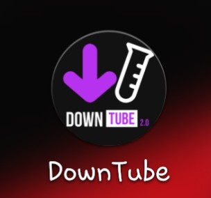
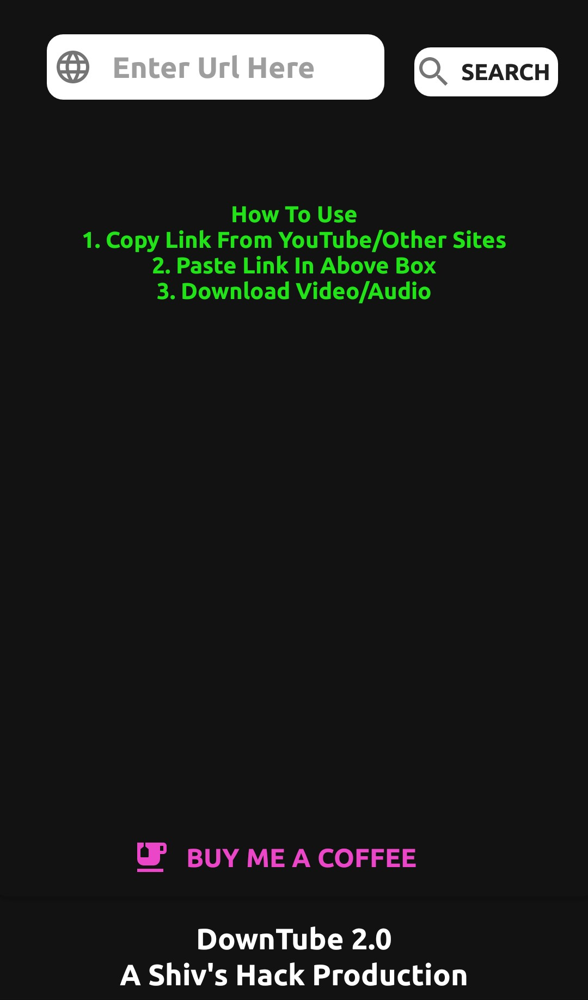
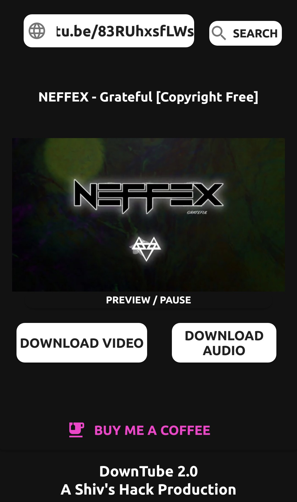

# DownTubeApp

Down Tube is an application held under Shiv's Inc based on a GitHub Library youtube-dl by yausername which simply  has the ability to download videos over different sites by getting the link of the video. Its main focus is on download the audio file but can also download video of the best quality available to it. Here you can fin the download link with some images of its user friendly UI and eye friendly colours.

Credits:  yausername (GitHub) <a href="https://github.com/yausername/youtubedl-android">Youtube-dl</a>

License: Icons and Other Content Under   Creative Commons and Apache License, Version 2.0

<h1><strong>Download DownTube</strong></h1>

You Can Use This Application for your Personal use By Downloading the application from here:  
<a href="https://drive.google.com/file/d/1BcPJEGrM4ETSdp_WJ5d6-dsLAa1cfk5A/view?usp=drivesdk">Download From Here</a>

<h1><strong>Screenshorts</strong></h1>

Here's Some Images 

DownTube is Open Source so Here's the source code enjoy improving 
Worked very hard to create This is not tested on more than 2 mobiles 

<h1><strong>Buy Me A Coffee</strong></h1>
  This application has no advertisement to show support 
  <a href="https://www.paypal.me/shivshacks">Buy me a coffee here</a>

<h3><strong>Thank You</strong></h3>

